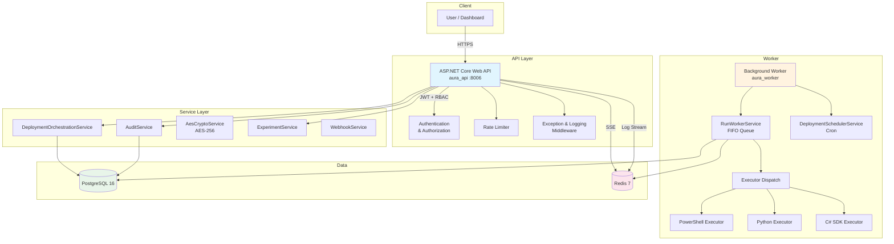

# Aura Platform

Multi-tenant infrastructure orchestration platform with JWT authentication, RBAC, deployment queue, cron scheduling, and real-time log streaming via Redis.

## Architecture



## Quick Start

```bash
# Clone the repository
git clone https://github.com/CloudAuraOfficial/aura-platform.git
cd aura-platform

# Copy and configure environment
cp .env.example .env
# Edit .env -- at minimum set JWT_SECRET and ENCRYPTION_KEY

# Start all services
docker compose up -d
```

This starts four containers:
- **postgres** (PostgreSQL 16) -- primary data store
- **redis** (Redis 7) -- pub/sub for real-time log streaming
- **aura_api** (port 8006) -- ASP.NET Core Web API + Razor Pages dashboard
- **aura_worker** -- background worker for deployment execution and cron scheduling

## API Endpoints

### Authentication (`/api/v1/auth`)

| Method | Path | Description | Auth |
|--------|------|-------------|------|
| `POST` | `/api/v1/auth/bootstrap` | Create initial admin user | None (first run only) |
| `POST` | `/api/v1/auth/login` | Authenticate and receive JWT + refresh token | None |
| `POST` | `/api/v1/auth/refresh` | Refresh an expired access token | Refresh token |
| `POST` | `/api/v1/auth/accept-invite` | Accept a user invitation and set password | Invite token |

### Essences (`/api/v1/essences`)

| Method | Path | Description | Auth |
|--------|------|-------------|------|
| `GET` | `/api/v1/essences` | List all essences for the tenant | JWT |
| `GET` | `/api/v1/essences/{id}` | Get essence by ID | JWT |
| `POST` | `/api/v1/essences` | Create a new essence | JWT |
| `PUT` | `/api/v1/essences/{id}` | Update an essence (creates a new version) | JWT |
| `GET` | `/api/v1/essences/{id}/versions` | List all versions of an essence | JWT |
| `GET` | `/api/v1/essences/{id}/versions/{v}` | Get a specific version | JWT |
| `GET` | `/api/v1/essences/{id}/versions/{v1}/diff/{v2}` | Diff two versions | JWT |
| `POST` | `/api/v1/essences/{id}/clone` | Clone an essence | JWT |
| `DELETE` | `/api/v1/essences/{id}` | Delete an essence | JWT (Admin) |

### Deployments (`/api/v1/deployments`)

| Method | Path | Description | Auth |
|--------|------|-------------|------|
| `GET` | `/api/v1/deployments` | List deployments | JWT |
| `GET` | `/api/v1/deployments/{id}` | Get deployment by ID | JWT |
| `POST` | `/api/v1/deployments` | Create a new deployment | JWT |
| `PUT` | `/api/v1/deployments/{id}` | Update a deployment | JWT |
| `DELETE` | `/api/v1/deployments/{id}` | Delete a deployment | JWT (Admin) |
| `POST` | `/api/v1/deployments/{id}/runs` | Trigger a deployment run | JWT |
| `GET` | `/api/v1/deployments/{id}/runs` | List runs for a deployment | JWT |
| `GET` | `/api/v1/deployments/{id}/runs/{runId}` | Get a specific run | JWT |
| `POST` | `/api/v1/deployments/{id}/runs/{runId}/cancel` | Cancel a running deployment | JWT |
| `GET` | `/api/v1/deployments/{id}/runs/{runId}/layers` | Get layer execution details | JWT |

### Users (`/api/v1/users`)

| Method | Path | Description | Auth |
|--------|------|-------------|------|
| `GET` | `/api/v1/users` | List users in the tenant | JWT (Admin) |
| `GET` | `/api/v1/users/{id}` | Get user by ID | JWT |
| `POST` | `/api/v1/users` | Create a user | JWT (Admin) |
| `POST` | `/api/v1/users/invite` | Invite a user via email | JWT (Admin) |
| `PUT` | `/api/v1/users/{id}` | Update a user | JWT |
| `DELETE` | `/api/v1/users/{id}` | Delete a user | JWT (Admin) |

### Other Endpoints

| Method | Path | Description | Auth |
|--------|------|-------------|------|
| `GET` | `/api/v1/cloud-accounts` | List cloud accounts | JWT |
| `GET` | `/api/v1/cloud-accounts/{id}` | Get cloud account | JWT |
| `POST` | `/api/v1/cloud-accounts` | Create cloud account (credentials encrypted with AES-256) | JWT |
| `PUT` | `/api/v1/cloud-accounts/{id}` | Update cloud account | JWT |
| `DELETE` | `/api/v1/cloud-accounts/{id}` | Delete cloud account | JWT |
| `GET` | `/api/v1/audit-log` | Query audit log entries | JWT (Admin) |
| `GET` | `/api/v1/deployments/{id}/runs/{runId}/logs/stream` | SSE real-time log stream via Redis pub/sub | JWT |
| `GET` | `/health` | Health check | None |
| `POST` | `/api/internal/deploy` | CI/CD webhook (triggers git pull + rebuild) | Bearer token |

## Tech Stack

| Component | Technology |
|-----------|------------|
| Runtime | .NET 8 / ASP.NET Core |
| API | REST controllers + Razor Pages dashboard |
| Auth | JWT Bearer + refresh tokens, RBAC (Admin/Member/Operator) |
| Database | PostgreSQL 16 (Entity Framework Core + Npgsql) |
| Cache / Streaming | Redis 7 (pub/sub for real-time log streaming) |
| Encryption | AES-256 for cloud account credentials |
| Metrics | prometheus-net |
| Rate Limiting | ASP.NET Core built-in (fixed window: 100 req/min global, 10 req/min auth) |
| Worker | Background services (FIFO deployment queue, cron scheduler, stuck-run reaper) |
| Executors | PowerShell, Python, C# SDK (layer execution dispatch) |
| Testing | xUnit + Moq + Testcontainers (130 tests) |
| CI/CD | GitHub Actions (build + test, webhook deploy, smoke test) |

## Configuration

All configuration is via environment variables (`.env` file).

| Variable | Description | Required | Default |
|----------|-------------|----------|---------|
| `POSTGRES_HOST` | PostgreSQL hostname | No | `localhost` |
| `POSTGRES_PORT` | PostgreSQL port | No | `5432` |
| `POSTGRES_DB` | Database name | No | `aura` |
| `POSTGRES_USER` | Database user | No | `aura` |
| `POSTGRES_PASSWORD` | Database password | Yes | -- |
| `REDIS_HOST` | Redis hostname | No | `localhost` |
| `REDIS_PORT` | Redis port | No | `6379` |
| `JWT_SECRET` | JWT signing key (min 64 chars) | Yes | -- |
| `JWT_ISSUER` | JWT issuer claim | No | `aura-platform` |
| `JWT_AUDIENCE` | JWT audience claim | No | `aura-platform` |
| `JWT_EXPIRY_MINUTES` | Access token TTL | No | `60` |
| `ENCRYPTION_KEY` | Base64-encoded 32-byte key for AES-256 | Yes | -- |
| `WORKER_CONCURRENCY` | Max concurrent deployment runs | No | `5` |
| `RUN_STALE_THRESHOLD_SECONDS` | Stuck-run reaper timeout | No | `7200` |
| `SCHEDULER_POLL_SECONDS` | Cron scheduler poll interval | No | `30` |
| `CORS_ORIGINS` | Comma-separated allowed origins | No | any |
| `DEPLOY_WEBHOOK_SECRET` | Bearer token for CI/CD deploy webhook | No | -- |
| `ASPNETCORE_ENVIRONMENT` | Runtime environment | No | `Production` |

## Testing

```bash
# Run all tests (130 tests)
dotnet test

# Run with verbosity
dotnet test --verbosity normal

# Run a specific project
dotnet test tests/Aura.Api.Tests
dotnet test tests/Aura.Infrastructure.Tests
```

The test suite uses Testcontainers for integration tests against real PostgreSQL and Redis instances.

## Monitoring

- **Health check**: `GET /health` returns `{"status": "healthy", "timestamp": "..."}`.
- **Prometheus metrics**: Exposed via prometheus-net at the standard `/metrics` endpoint.
- **Real-time logs**: `GET /api/v1/deployments/{id}/runs/{runId}/logs/stream` provides Server-Sent Events for live deployment log output via Redis pub/sub.
- **Audit log**: All write operations are recorded in the audit log, queryable via `GET /api/v1/audit-log`.
- **CI/CD**: GitHub Actions runs build + test on every push, then triggers a deploy webhook for automatic VPS deployment.

## Project Structure

```
aura-platform/
├── docker-compose.yml
├── .env.example
├── src/
│   ├── Aura.Core/               # Domain models, DTOs, interfaces
│   │   ├── DTOs/
│   │   ├── Entities/
│   │   └── Interfaces/
│   ├── Aura.Infrastructure/     # EF Core, service implementations
│   │   ├── Data/                # DbContext, migrations
│   │   └── Services/            # AuditService, CryptoService, OrchestrationService, etc.
│   ├── Aura.Api/                # ASP.NET Core host
│   │   ├── Controllers/         # Auth, Essences, Deployments, Users, CloudAccounts, AuditLog, LogStream
│   │   ├── Middleware/          # Exception handler, request logging
│   │   ├── Services/            # HttpTenantContext
│   │   └── Program.cs           # DI, auth, CORS, rate limiting, middleware pipeline
│   └── Aura.Worker/             # Background worker host
│       ├── Services/            # RunWorkerService (FIFO), DeploymentSchedulerService (cron)
│       └── Executors/           # PowerShell, Python, C# SDK executors
├── tests/
│   ├── Aura.Api.Tests/
│   └── Aura.Infrastructure.Tests/
├── scripts/
│   └── deploy.sh
└── .github/
    └── workflows/
```
